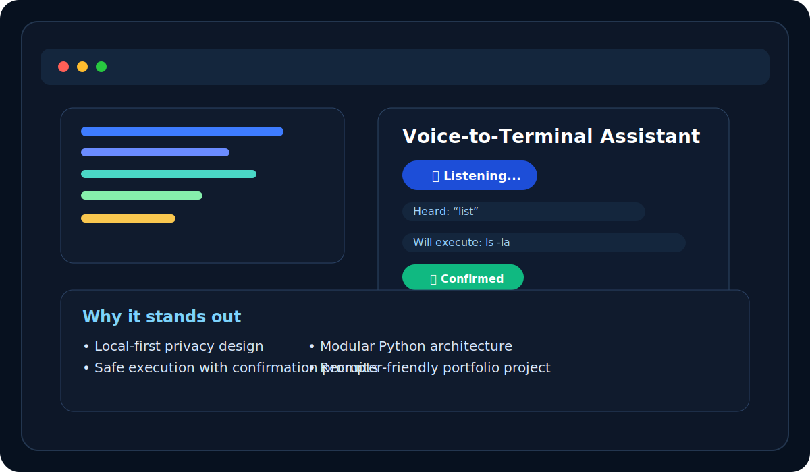

# 🎙️ Voice-to-Terminal Assistant

```text
  __      __   _   _   _____                 _   _   _
  \ \    / /  | | | | |_   _|__  __ _  ___  | |_| |_| | ___
   \ \  / /   | |_| |   | |/ _ \/ _` |/ _ \ | __| __| |/ _ \
    \ \/ /    |  _  |   | |  __/ (_| |  __/ | |_| |_| |  __/
     \_/     |_| |_|   |_|\___|\__, |\___|  \__|\__|_|\___|
                                |___/
```

A polished, privacy-first voice-driven CLI assistant that turns spoken commands into safe terminal actions. Built as a local-first desktop project, it combines speech recognition, command automation, and security in a clean, recruiter-friendly experience.

  

## ✨ Why this project stands out

This project is designed to feel like a real product, not just a demo script. It highlights:

- Voice interaction with local speech recognition
- Safe command execution with guardrails and validation
- A polished CLI experience with clear prompts and feedback
- Modular Python architecture that is easy to extend
- Privacy-first engineering built for real-world use

It is a strong example of a developer who can combine automation, security, UX, and software design in one project.

## 🖼️ Interface preview

<p align="center">
  
</p>

## ▶️ Demo

Here is a sample interaction:

```text
🎤 VOICE MODE - Start speaking your command...
📝 Heard: 'list'
🔧 Will execute: 'ls -la'
Continue? (y/n): y
✅ Command executed

📤 Output:
total 24
-rw-r--r-- 1 user user  4096 Jul 21 10:00 main.py
-rw-r--r-- 1 user user  4096 Jul 21 10:00 voice_processor.py
```

## 🚀 Quick start

### 1. Clone the project

```bash
git clone <your-repo-url>
cd voice-terminal-assistant
```

### 2. Create a virtual environment

```bash
python -m venv venv
source venv/bin/activate
```

On Windows PowerShell:

```powershell
venv\Scripts\Activate.ps1
```

### 3. Install dependencies

```bash
pip install -r requirements.txt
```

### 4. Run the assistant

```bash
python main.py
```

## ✨ Features

- 🎤 Natural voice input for hands-free command control
- 🛡️ Privacy-first local processing with no cloud dependency
- 🔒 Safe command validation and blocking of destructive actions
- 📝 Manual fallback mode when voice input is unavailable
- 📜 Command history tracking for transparency and review
- 📊 Local logging for debugging and auditability
- ⚙️ Clean modular architecture with automated tests

## 📈 Impact

This project demonstrates practical value in three areas:

- Productivity: faster command execution through conversational interaction
- Security: safer terminal usage with clear validation and confirmation flows
- Engineering quality: solid Python architecture, testing, and maintainability

## 🛠️ Tech stack

- Python 3.8+
- SpeechRecognition
- PyAudio / PocketSphinx
- Standard library modules for subprocess, logging, and testing

## 🧠 How it works

The project is organized into focused modules:

- [main.py](main.py) — interactive CLI experience and user flow
- [voice_processor.py](voice_processor.py) — microphone capture and speech recognition
- [command_executor.py](command_executor.py) — command mapping, validation, and execution
- [config.py](config.py) — centralized settings and allowed commands
- [tests](tests) — regression tests and behavior checks

## 🎯 Example voice commands

The assistant currently supports commands such as:

- "list" → runs `ls -la`
- "current directory" → runs `pwd`
- "date" → runs `date`
- "system info" → runs `uname -a`
- "memory" → runs `free -h`

## 🔐 Security first

The assistant is intentionally conservative:

- Dangerous commands such as `rm -rf /` are blocked
- Sudo execution is disabled by default
- Confirmation prompts are required before execution
- All actions are logged locally

## 🧪 Testing

Run the test suite:

```bash
python -m unittest discover -s tests
```

## 📁 Project structure

```text
voice-terminal-assistant/
├── main.py
├── voice_processor.py
├── command_executor.py
├── config.py
├── requirements.txt
├── README.md
├── LICENSE
├── pyproject.toml
└── tests/
```

## 🌟 Why recruiters will like this

This project highlights practical software engineering skills:

- Python application design
- Human-computer interaction concepts
- Secure command execution patterns
- Testing and maintainability
- A portfolio-ready project with strong documentation and structure

## 🛣️ Future enhancements

Planned improvements include:

- Wake-word activation
- Multi-language speech support
- Text-to-speech responses
- Richer command templates and aliases
- A GUI or web-based companion interface

## 📄 License

This project is licensed under the MIT License.
